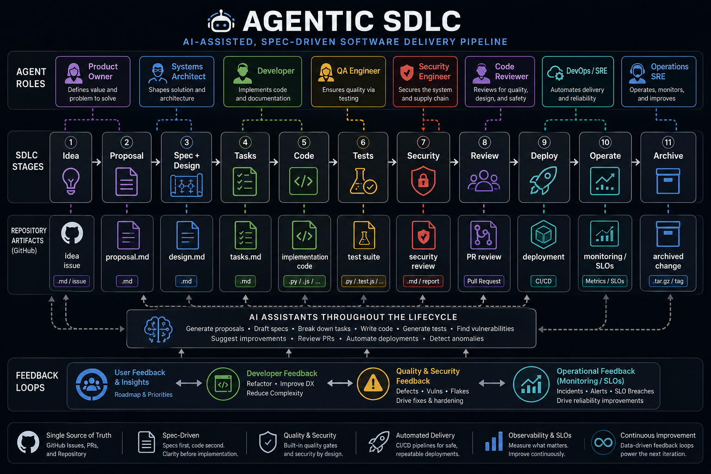

# GitHub Copilot Workshop

This repository hosts a hands-on workshop for beginner, intermediate, and advanced developers to learn how to use GitHub Copilot effectively.

## Learning goals

- Build practical Copilot habits for everyday coding.
- Move from prompt quality and pair-programming fundamentals to agentic workflows.
- End with an automated issue-to-Copilot flow where tasks can be handled autonomously.

## Workshop tracks

- Beginner: prompt crafting, chat context, and safe code generation.
- Intermediate: test-driven workflows, refactoring, and review loops.
- Advanced: CI/CD + autonomous issue handling with Copilot-CLI coding agent.

See the full roadmap in doc/workshop-roadmap.md.

## Agentic SDLC Spec driven diagram

```mermaid
flowchart LR
    %% =======================
    %% DARK THEME STYLING
    %% =======================
    classDef stage fill:#1f2937,stroke:#60a5fa,color:#e5e7eb,stroke-width:1px;
    classDef role fill:#111827,stroke:#10b981,color:#d1fae5,stroke-width:1px;
    classDef gate fill:#111827,stroke:#f59e0b,color:#fde68a,stroke-dasharray: 5 5;

    %% =======================
    %% PRODUCT OWNER LANE
    %% =======================
    subgraph PO_LANE [👤 Product Owner]
        direction LR
        A["Idea<br/>idea issue"]
        B["Proposal<br/>proposal.md"]
    end

    %% =======================
    %% ARCHITECT LANE
    %% =======================
    subgraph SA_LANE [🏗️ Systems Architect]
        direction LR
        C["Spec + Design<br/>design.md"]
    end

    %% =======================
    %% DEVELOPER LANE
    %% =======================
    subgraph DEV_LANE [👨‍💻 Developer]
        direction LR
        D["Tasks<br/>tasks.md"]
        E["Code<br/>implementation"]
    end

    %% =======================
    %% QA LANE
    %% =======================
    subgraph QA_LANE [🧪 QA Engineer]
        direction LR
        F["Tests<br/>test suite"]
    end

    %% =======================
    %% SECURITY LANE
    %% =======================
    subgraph SEC_LANE [🔐 Security Engineer]
        direction LR
        G["Security<br/>review"]
    end

    %% =======================
    %% REVIEW LANE
    %% =======================
    subgraph REV_LANE [👁️ Code Reviewer]
        direction LR
        H[PR Review]
    end

    %% =======================
    %% DEVOPS LANE
    %% =======================
    subgraph SRE_LANE [⚙️ DevOps / SRE]
        direction LR
        I[Deploy]
    end

    %% =======================
    %% OPERATIONS LANE
    %% =======================
    subgraph OPS_LANE [📊 Operations SRE]
        direction LR
        J["Operate<br/>monitoring / SLOs"]
        K["Archive<br/>change"]
    end

    %% =======================
    %% PIPELINE FLOW
    %% =======================
    A --> B --> C --> D --> E --> CI --> F --> SEC_GATE --> G --> PR_GATE --> H --> CD --> I --> J --> K

    %% =======================
    %% CI/CD GATES
    %% =======================
    CI{{CI Pipeline<br/>build + test}}
    SEC_GATE{{Security Gate<br/>scan + policy}}
    PR_GATE{{PR Approval<br/>review gate}}
    CD{{CD Pipeline<br/>release}}

    %% =======================
    %% FEEDBACK LOOP
    %% =======================
    J -- telemetry & insights --> A

    %% =======================
    %% CLASS ASSIGNMENTS
    %% =======================
    class A,B,C,D,E,F,G,H,I,J,K stage;
    class PO_LANE,SA_LANE,DEV_LANE,QA_LANE,SEC_LANE,REV_LANE,SRE_LANE,OPS_LANE role;
    class CI,SEC_GATE,PR_GATE,CD gate;
```

## Agentic SDLC process diagram

The workshop content is curated from:

- [VS Code Agents application](https://code.visualstudio.com/docs/copilot/agents-app) — primary IDE for all workshop participants
- [OpenSpec: a community-driven repository of best practices for prompt engineering and agent design.](https://github.com/Fission-AI/OpenSpec)
- [Agentic DevOps in action: Reimagining every phase of the developer lifecycle](https://developer.microsoft.com/blog/reimagining-every-phase-of-the-developer-lifecycle)
- [GitHub Copilot CLI](https://docs.github.com/en/copilot/how-tos/copilot-cli)
- [awesome-copilot Learning Hub](https://awesome-copilot.github.com/learning-hub/)
- [GitHub Awesome Copilot](https://github.com/github/awesome-copilot)
- [VS Code .github build patterns](https://github.com/microsoft/vscode/tree/main/.github)
- [VS Code Copilot Agents App](https://code.visualstudio.com/docs/copilot/agents-app)

## Shared agentic assets

Reusable Software Fabric workflows, templates, prompts, instructions, agents, and skills are now sourced from [`ralphke/agentic-shared`](https://github.com/ralphke/agentic-shared). Use `.github/workflows/sync-agentic-shared.yml` to pull the canonical shared content into this repository.

Workshop-specific labs, documentation, and environment setup remain owned locally in this repository.

## Repository layout

- .github/prompts: prompt history recorded in operation order.
- .github/workflows: CI and Copilot automation workflows.
- doc: workshop guides, facilitator notes, and participant setup instructions (doc/setup.md).
- lab: participant exercises by level.
- src: optional source exercises.
- spec: optional specification for exercises.
- test: optional validation tests for exercises.

## Prerequisites

> **Primary IDE for this workshop:** [VS Code Agents application](https://code.visualstudio.com/docs/copilot/agents-app) (bundled with VS Code Insiders). See **doc/setup.md** for installation and sign-in instructions before starting any lab.

- VS Code Insiders installed with the Agents application open
- GitHub account with an active Copilot subscription
- This repository cloned and trusted in the Agents app

## Quick start

1. Create issues from the Copilot task issue template.
2. Add the label copilot-task.
3. The workflow auto-routes the issue and asks Copilot to start work.
4. CI runs on pull requests so proposed changes are validated.

## Notes

- Automation requires GitHub Copilot-CLI coding agent availability on the repository/org.
- If Copilot-CLI cannot be auto-assigned in your org, the workflow leaves guidance comments so a maintainer can continue manually.
