# GitHub Copilot Software Fabric - Autonomous SDLC and Workshops

This repository hosts a hands-on workshop for beginner, intermediate, and advanced developers to learn how to use GitHub Copilot effectively.

## Learning goals

- Build practical Copilot habits for everyday coding.
- Move from prompt quality and pair-programming fundamentals to agentic workflows.
- End with an automated issue-to-Copilot flow where tasks can be handled autonomously.

## Workshop tracks

- Beginner: prompt crafting, chat context, and safe code generation.
- Intermediate: test-driven workflows, refactoring, and review loops.
- Advanced: CI/CD + autonomous issue handling with Copilot-CLI coding agent.

See the full roadmap in doc/workshop-roadmap.md.

## Agentic SDLC Spec driven diagram

```mermaid
flowchart LR
    %% =======================
    %% DARK THEME STYLING
    %% =======================
    classDef stage fill:#1f2937,stroke:#60a5fa,color:#e5e7eb,stroke-width:1px;
    classDef role fill:#111827,stroke:#10b981,color:#d1fae5,stroke-width:1px;
    classDef gate fill:#111827,stroke:#f59e0b,color:#fde68a,stroke-dasharray: 5 5;

    %% =======================
    %% PRODUCT OWNER LANE
    %% =======================
    subgraph PO_LANE [👤 Product Owner]
        direction LR
        A["Idea<br/>idea issue"]
        B["Proposal<br/>proposal.md"]
    end

    %% =======================
    %% ARCHITECT LANE
    %% =======================
    subgraph SA_LANE [🏗️ Systems Architect]
        direction LR
        C["Spec + Design<br/>design.md"]
    end

    %% =======================
    %% DEVELOPER LANE
    %% =======================
    subgraph DEV_LANE [👨‍💻 Developer]
        direction LR
        D["Tasks<br/>tasks.md"]
        E["Code<br/>implementation"]
    end

    %% =======================
    %% QA LANE
    %% =======================
    subgraph QA_LANE [🧪 QA Engineer]
        direction LR
        F["Tests<br/>test suite"]
    end

    %% =======================
    %% SECURITY LANE
    %% =======================
    subgraph SEC_LANE [🔐 Security Engineer]
        direction LR
        G["Security<br/>review"]
    end

    %% =======================
    %% REVIEW LANE
    %% =======================
    subgraph REV_LANE [👁️ Code Reviewer]
        direction LR
        H[PR Review]
    end

    %% =======================
    %% DEVOPS LANE
    %% =======================
    subgraph SRE_LANE [⚙️ DevOps / SRE]
        direction LR
        I[Deploy]
    end

    %% =======================
    %% OPERATIONS LANE
    %% =======================
    subgraph OPS_LANE [📊 Operations SRE]
        direction LR
        J["Operate<br/>monitoring / SLOs"]
        K["Archive<br/>change"]
    end

    %% =======================
    %% PIPELINE FLOW
    %% =======================
    A --> B --> C --> D --> E --> CI --> F --> SEC_GATE --> G --> PR_GATE --> H --> CD --> I --> J --> K

    %% =======================
    %% CI/CD GATES
    %% =======================
    CI{{CI Pipeline<br/>build + test}}
    SEC_GATE{{Security Gate<br/>scan + policy}}
    PR_GATE{{PR Approval<br/>review gate}}
    CD{{CD Pipeline<br/>release}}

    %% =======================
    %% FEEDBACK LOOP
    %% =======================
    J -- telemetry & insights --> A

    %% =======================
    %% CLASS ASSIGNMENTS
    %% =======================
    class A,B,C,D,E,F,G,H,I,J,K stage;
    class PO_LANE,SA_LANE,DEV_LANE,QA_LANE,SEC_LANE,REV_LANE,SRE_LANE,OPS_LANE role;
    class CI,SEC_GATE,PR_GATE,CD gate;
```



## Agentic SDLC process diagram


The workshop content is curated from:

- [VS Code Agents application](https://code.visualstudio.com/docs/copilot/agents-app) — primary IDE for all workshop participants
- [OpenSpec: a community-driven repository of best practices for prompt engineering and agent design.](https://github.com/Fission-AI/OpenSpec)
- [Agentic DevOps in action: Reimagining every phase of the developer lifecycle](https://developer.microsoft.com/blog/reimagining-every-phase-of-the-developer-lifecycle)
- [GitHub Copilot CLI](https://docs.github.com/en/copilot/how-tos/copilot-cli)
- [awesome-copilot Learning Hub](https://awesome-copilot.github.com/learning-hub/)
- [GitHub Awesome Copilot](https://github.com/github/awesome-copilot)
- [VS Code .github build patterns](https://github.com/microsoft/vscode/tree/main/.github)
- [VS Code Copilot Agents App](https://code.visualstudio.com/docs/copilot/agents-app)

## Shared agentic assets

Reusable Software Fabric workflows, templates, prompts, instructions, agents, and skills are now sourced from [`ralphke/agentic-shared`](https://github.com/ralphke/agentic-shared). Use `.github/workflows/sync-agentic-shared.yml` to pull the canonical shared content into this repository.

Workshop-specific labs, documentation, and environment setup remain owned locally in this repository.

## How the repos relate to each other

This repository is intentionally split into two concerns:

1. A local project repo: the repo you are actively working in, such as `Agentic-Coding` or your own fork of it.
2. A shared asset repo: a reusable asset library such as `agentic-shared`.

The local repo owns the project-specific work: workshop content, docs, lab exercises, OpenSpec change proposals, implementations, local specs, and repo-specific automation. The shared repo owns reusable patterns that can be adopted by many projects: generic agents, skills, workflow definitions, prompts, shared instructions, and template conventions.

This distinction is configured in [.agentic-shared.yml](.agentic-shared.yml). That file declares the shared source repository and the local paths that are managed versus protected. In practice:

- `Agentic-Coding` is the working repo for active SDLC work.
- `agentic-shared` is a reference store for reusable assets.
- Local files remain under the repository you are developing; shared files are synced or imported rather than treated as the main implementation home.
- The OpenSpec project root should stay in the local repo, not in the shared repo.

This means your day-to-day work should happen in the project repo. If you want to update a shared workflow or a generic agent definition, do that in the shared repo or through the shared-sync process, then pull the change into the project repo. Do not treat the shared repo as the active project for product or feature work.

### Recommended fork/clone pattern for new users

If you want to start from this repo and create your own project:

```powershell
# 1) Clone the local project repo you want to build from
# Example: your own fork of Agentic-Coding
cd D:\repos
git clone https://github.com/<your-user>/Agentic-Coding.git
cd Agentic-Coding

# 2) Keep the shared asset repo separate
cd ..
git clone https://github.com/ralphke/agentic-shared.git

# 3) Initialize OpenSpec in the project repo, not in the shared repo
cd ..\Agentic-Coding
openspec init .
openspec context --json
```

The important rule is: the project repo is the one where you create ideas, proposals, change specs, and implementation tasks through `/opsx:` commands. The shared repo remains the upstream source for reusable, cross-project patterns.

If you want your own custom shared asset library, you can point [.agentic-shared.yml](.agentic-shared.yml) to your fork of `agentic-shared`, but keep the active project repo as the root for OpenSpec work and feature delivery.

## Initializing a new repo with OpenSpec and associating it with a shared store

Use the repo-local OpenSpec root for the project you are actively working in. Keep the shared store repo, such as `agentic-shared`, as a separate repository that provides reusable assets and sync patterns rather than as the working repo root itself.

For this environment, the supported command is:

```powershell
cd "D:\path\to\your\new-repo"
openspec init .
openspec context --json
```

This initializes the repo at the current folder and creates the local OpenSpec configuration under `spec/openspec` (or the configured path for that repo).

The command, `openspec context --json` should return the active repo root and confirm the working directory is recognized as an OpenSpec project.

When you want to use a shared store repo:

1. After you initialized the project repo locally with `openspec init .`.
2. Keep the shared store as a separate clone or remote repository, such as `agentic-shared`.
3. Sync or consume the shared assets from the shared repo into the local project repo using the repository's documented workflow or scripts.
4. Treat the local project repo and the shared store repo as different concerns: the local repo owns the active product work; the shared repo owns reusable patterns and templates.

Example pattern:

```powershell
# local project repo
cd "D:\repros\Agentic-Coding"
openspec init .
openspec context --json

# shared store repo remains separate
# git clone https://github.com/ralphke/agentic-shared.git
```

This avoids mixing the working repo root with the shared asset repository and keeps configuration and local spec state tied to the project being built.openspec vrify

## Repository layout

- .github/prompts: prompt history recorded in operation order.
- .github/workflows: CI and Copilot automation workflows.
- doc: workshop guides, facilitator notes, and participant setup instructions (doc/setup.md).
- lab: participant exercises by level.
- src: optional source exercises.
- spec: optional specification for exercises.
- test: optional validation tests for exercises.

## Devcontainer vs manual Docker build

This repository uses `.devcontainer/devcontainer.json` as the primary VS Code container definition for the normal workshop workflow.

- `devcontainer.json` is the source of truth for VS Code devcontainer opens and rebuilds.
- `.devcontainer/docker-compose.yml` and `.devcontainer/Dockerfile.security-fix` are optional manual build helpers.
- `.devcontainer/docker-compose.local.yml` is an optional local override for developer testing.
- The manual compose path is aligned to the same base image as `devcontainer.json`; keep `Dockerfile.security-fix` updated if the devcontainer base image changes.
- Prefer the `devcontainer.json` path unless you explicitly need a custom Docker compose build.

Local testing workflow with the override file:

```powershell
docker compose -f .devcontainer/docker-compose.yml -f .devcontainer/docker-compose.local.yml build --no-cache
docker compose -f .devcontainer/docker-compose.yml -f .devcontainer/docker-compose.local.yml up -d
```

This keeps the default compose file pinned to the hardened GHCR image while still allowing quick local rebuilds.

### Push local image to GHCR

Use the PowerShell helper script to push `agentic-coding-image:latest` to GitHub Container Registry:

```powershell
./scripts/push-ghcr-image.ps1 -Owner <github-owner>
```

Authentication options:

- Set `GITHUB_TOKEN` in your shell (recommended for CI and local automation).
- Or sign in with GitHub CLI (`gh auth login`), then the script can use `gh auth token`.

Required token scopes for GHCR push:

- `write:packages`
- `read:packages`

Explicit token usage example (PowerShell):

```powershell
$env:GITHUB_TOKEN = "<github_pat_with_write_packages>"
./scripts/push-ghcr-image.ps1 -Owner <github-owner>
```

Optional SHA tag push:

```powershell
./scripts/push-ghcr-image.ps1 -Owner <github-owner> -PushShaTag -ShaTag <commit-sha>
```

## Prerequisites

> **Primary IDE for this workshop:** [VS Code Agents application](https://code.visualstudio.com/docs/copilot/agents-app) (bundled with VS Code Insiders). See **doc/setup.md** for installation and sign-in instructions before starting any lab.

- VS Code Insiders installed with the Agents application open
- GitHub account with an active Copilot subscription
- This repository cloned and trusted in the Agents app

## Quick start

1. Create issues from the Copilot task issue template.
2. Add the label copilot-task.
3. The workflow auto-routes the issue and asks Copilot to start work.
4. CI runs on pull requests so proposed changes are validated.

## Notes

- Automation requires GitHub Copilot-CLI coding agent availability on the repository/org.
- If Copilot-CLI cannot be auto-assigned in your org, the workflow leaves guidance comments so a maintainer can continue manually.
