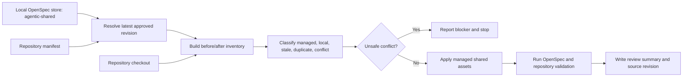

# Design: Clean Up and Sync Agentic Shared Assets

**Change Slug:** `sync-agentic-shared-cleanup`

## Decision

Use the OpenSpec CLI store operation as the only authoritative way to access the local `agentic-shared` repository content. Resolve the store through the CLI first, then validate the repository manifest and existing synchronization workflow when present. The implementation will add only the minimum reconciliation and validation support needed to make the selected latest approved revision explicit, preserve local extensions, prevent unsafe overwrites, and produce a reviewable inventory.

The sync is a file reconciliation operation, not a runtime service. It will operate on declared managed paths and will fail closed when ownership, source revision, or conflict state cannot be determined.

## Component Diagram

## Inputs and Outputs

### Inputs

- Local OpenSpec CLI store identifier: `agentic-shared`.
- OpenSpec CLI store-operation command and captured output identifying the resolved repository revision.
- Repository manifest, expected at `.agentic-shared.yml` when configured.
- Existing synchronization workflow, expected at `.github/workflows/sync-agentic-shared.yml` when configured.
- Current repository tree and version-control state.
- Reserved repository-local extension paths, including `local/` paths declared by the manifest.

### Outputs

- Updated managed shared assets only.
- Updated manifest or synchronization configuration when required to represent ownership accurately.
- Before/after inventory and synchronization summary containing source revision/date, changed paths, removals, preserved local paths, conflicts, and validation results.
- Non-zero/blocking result when the source cannot be resolved or an unsafe conflict is detected.

## Synchronization Contract

1. Resolve the latest approved source revision through the OpenSpec CLI store operation before reading or changing repository-managed files.
2. Treat manifest-declared managed paths as eligible for replacement or removal.
3. Treat manifest-declared local paths as repository-owned and immutable during sync.
4. Do not delete an undeclared path solely because it is absent from the shared source.
5. Do not overwrite a locally modified managed file without an explicit conflict decision.
6. Record the exact source revision and source date in the review summary.
7. Validate the resulting tree before reporting success.

## Architecture Decisions

### ADR-001: Reuse the Existing Sync Boundary

**Decision:** Use the existing manifest/workflow boundary instead of introducing a second asset distribution mechanism.

**Rationale:** Shared assets are already documented as sourced from `ralphke/agentic-shared`; duplicating the mechanism would create competing ownership rules and increase drift.

### ADR-002: Fail Closed on Ownership Ambiguity

**Decision:** Stop synchronization when a file's managed/local ownership or local modification state cannot be established.

**Rationale:** Cleanup can delete or overwrite instructions that control the SDLC pipeline. A visible blocker is safer than an irreversible implicit choice.

### ADR-003: Keep the Change Reversible

**Decision:** Capture a before/after inventory and source revision before applying changes.

**Rationale:** The repository must be able to restore the previous managed state if validation or review rejects the update.

## Validation Plan

- Validate manifest syntax and managed/local ownership declarations.
- Validate source revision resolution and reject an empty or floating result when the existing workflow requires a pinned revision.
- Validate OpenSpec structure using `scripts/validate-openspec-local.sh` where applicable.
- Validate prompt ordering and workflow structure using the repository CI checks.
- Confirm no credentials or generated machine-specific metadata appear in the output.
- Confirm the review summary contains all changed and removed paths plus conflicts and command results.

## Rollback

Restore the recorded pre-sync source revision, managed files, and manifest state from the before-inventory. Do not roll back unrelated local changes or unrelated OpenSpec changes.
