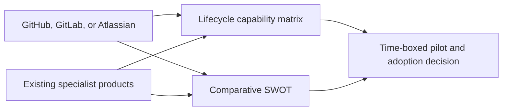

# Design: Compare Source-Control and Work-Management Platforms by Lifecycle Phase

## Decision

Add one compact lifecycle matrix before the product catalogue and one platform
SWOT table after it. The matrix keeps each comparison phase-specific; the SWOT
table records cross-cutting adoption tradeoffs without repeating every product
description or pricing claim.

## Rationale

- Platform products span multiple phases, so adding them as repeated catalogue
  rows would obscure their connected workflow value.
- Existing specialist entries already describe individual products; the new
  comparison therefore identifies only the native capability and the material
  specialist gap.
- Capability availability depends on plan, deployment model, and region. Links
  to vendor documentation are more durable than copying granular entitlement
  claims into this reference.

## Component Diagram

## Validation

1. Verify each lifecycle phase has all three platform entries and a specialist comparison.
2. Verify the SWOT table covers strengths, weaknesses, opportunities, and threats for each platform.
3. Run the repository CI workflow's Markdown structure checks.
